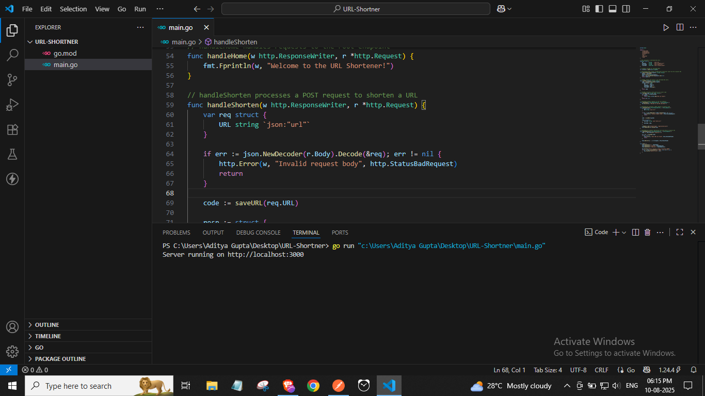
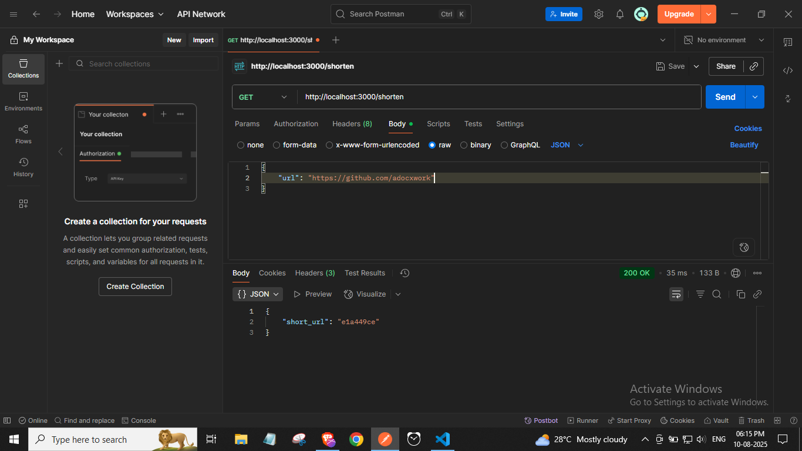
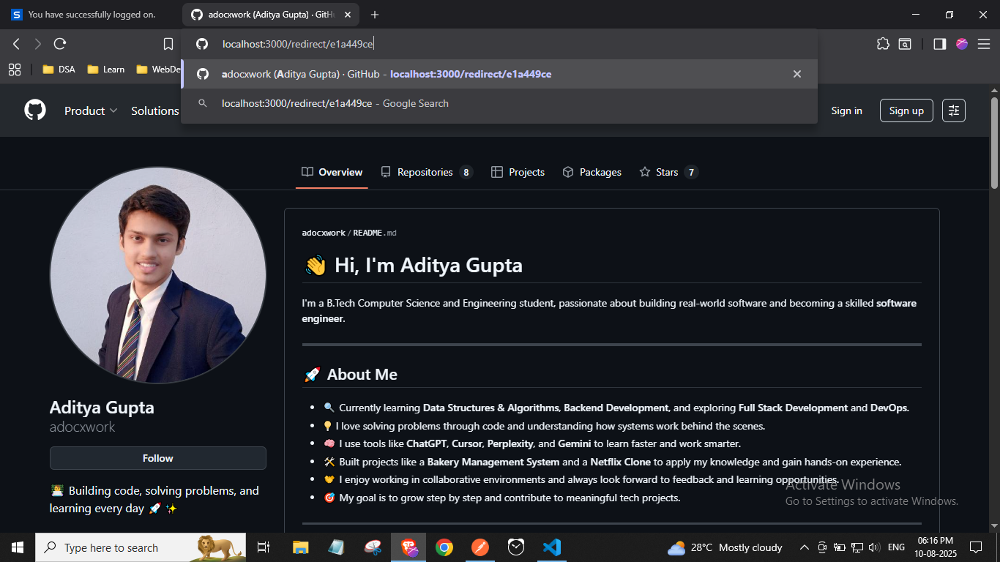

Sure! Here's your updated `README.md` written in a normal, clean, and easy-to-read style — just like before, but with the updated folder structure and license section added.

---

# URL Shortener

A simple URL shortener built with Go (Golang). It helps you turn long links into short ones and lets you visit them again using a short code.

---

## Features

* Shortens long URLs to 8-character codes
* Redirects short URLs to original ones
* Stores data in memory (no database needed)
* Easy-to-use JSON API
* Fast and lightweight

---

## Folder Structure

```
URL-Shortner/
├── go.mod
├── main.go
├── LICENSE
└── assets/
    ├── image1.png
    ├── image2.png
    └── image3.png
```

---

## Getting Started

### Requirements

* Go 1.18 or higher

### Run the app

1. Clone the repository:

   ```bash
   git clone https://github.com/yourusername/URL-Shortner.git
   cd URL-Shortner
   ```

2. Start the server:

   ```bash
   go run main.go
   ```

3. Open in your browser:
   [http://localhost:3000](http://localhost:3000)

---

## API Endpoints

### `GET /`

Returns a welcome message.

---

### `POST /shorten`

Shortens a long URL.

**Request (JSON):**

```json
{
  "url": "https://example.com"
}
```

**Response (JSON):**

```json
{
  "short_url": "a1b2c3d4"
}
```

---

### `GET /redirect/{shortcode}`

Redirects to the original URL.

Example:
`GET /redirect/a1b2c3d4`
Redirects to: `https://example.com`

---

## Notes

* URLs are stored in memory only — they are lost when the server restarts.
* Short codes are generated using the first 8 characters of an MD5 hash of the original URL.

---

## Screenshots

### Image 1



### Image 2



### Image 3



---

## License

This project is licensed under the [MIT License](LICENSE).
You are free to use, modify, and share it.
